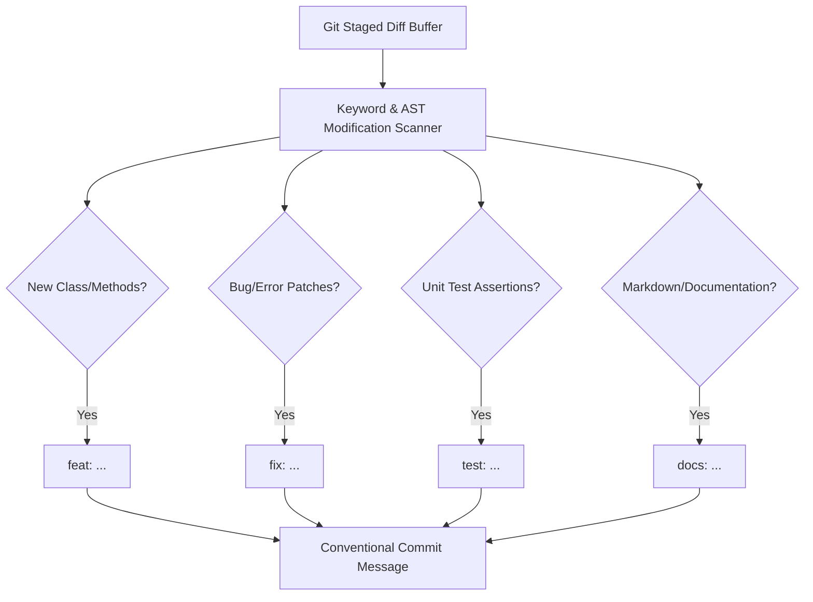

# genpark-git-conventional-commit-changelog-generator-skill

Agent Skill implementing **Semantic Diff Analysis & Conventional Commit Synthesis** in 100% Python standard library.

## Architectural Flow

